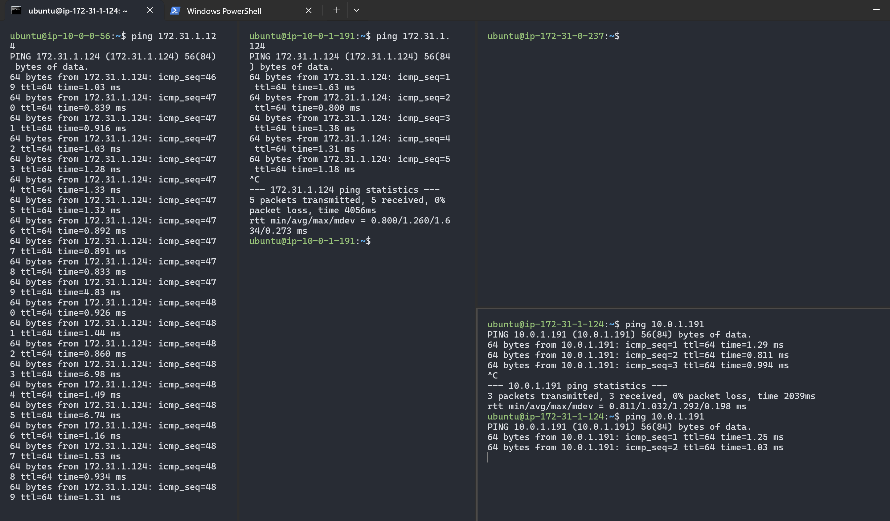

## VPC Peering
VPC-HCM (Requester) - 10.0.0.0/16
- public-subnet: 10.0.0.0/24
- private-subnet: 10.0.1.0/24
VPC-HCM (Accepter) - 172.31.0.0/16
- public-subnet: 172.31.0.0/24
- private-subnet: 172.31.1.0/24

### VPC Peering Connection
*Step 1: Create a VPC Peering Connection from VPC-HCM (Requester) to VPC-HCM (Accepter)*

1. AWS Management Console > VPC > Peering Connections
2. Click on "Create Peering Connection"
3. Select "VPC-HCM (Requester)" as the requester VPC
4. Select "VPC-HCM (Accepter)" as the accepter VPC
5. Click on "Create Peering Connection"

*Step 2: Accept the VPC Peering Connection in VPC-HCM (Accepter)*

1. AWS Management Console > VPC > Peering Connections
2. Choose the peering connection you just created
3. Click on "Actions" and select "Accept Request"

*Step 3: Update Route Tables in VPC-HCM*
1. AWS Management Console > VPC > Route Tables
2. Select the route table associated with the public subnet (10.0.0.0/24)
3. Click on "Edit routes"
4. Add a new route:
   - Destination: 172.31.1.0/24
   - Target: VPC Peering Connection (select the peering connection)
5. Click on "Save routes"

>*Note: you can add 172.31.0.0/24 if you want to allow access to the public subnet in VPC-HN. If you want to allow access to the VPC-HN, add 172.31.0.0/24*

Example: In this picture, I only added the route to the private subnet of VPC-HN.

*Step 4: Update Route Tables in VPC-HN*
1. AWS Management Console > VPC > Route Tables
2. Select the route table associated with the private subnet (172.31.1.0/24)
3. Click on "Edit routes"
4. Add a new route:
   - Destination: 10.0.1.0/24
   - Target: VPC Peering Connection (select the peering connection)
5. Click on "Save routes"

In this picture, I only added the route to the private subnet of VPC-HCM.

*Step 5: Update Security Groups*

Update the security groups in both VPCs to allow traffic between them.

In VPC-HCM, update the security group associated with the public subnet to allow inbound traffic from the private subnet of VPC-HN (172.31.1.0/24).

In VPC-HN, update the security group associated with the private subnet to allow inbound traffic from the public subnet and private subnet of VPC-HCM.

And then, I tested the connection by launching an EC2 instance in the public subnet and private subnet of VPC-HCM and trying to access the EC2 instance in the private subnet of VPC-HN.

In this picture, I pinged the private IP address of the EC2 instance in VPC-HN from the EC2 instance in the public subnet of VPC-HCM but it failed because I didn't add the route of public subnet of VPC-HCM to the route table of private subnet of VPC-HN.

Now, I will add private subnet of VPC-HN to the route table of public subnet of VPC-HCM.

It worked! I can now ping the private IP address of the EC2 instance in VPC-HN from the EC2 instance in the public subnet of VPC-HCM.

> ***Note: You can also add VPC-HCM both public and private subnets to the route table of VPC-HN private subnet and public subnet, and then you can configure the security groups to allow traffic between them.***

### Summary
VPC peering allows you to connect two VPCs, enabling resources in one VPC to communicate with resources in another VPC using private IP addresses. In this guide, we created a VPC peering connection between two VPCs (VPC-HCM and VPC-HN), updated the route tables to allow traffic between them, and configured security groups to permit communication. After completing these steps, we successfully tested the connection by pinging instances across the peered VPCs.

